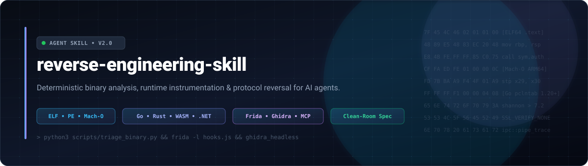

<p align="center">
  
</p>

# reverse-engineering-skill

A practical, deterministic reverse engineering playbook and toolset designed for AI coding agents and human engineers alike.

<p align="center">
  <a href="https://www.npmjs.com/package/reverse-engineering-skill"></a>
  <a href="https://github.com/PyModel/reverse-engineering-skill/releases"></a>
  <a href="https://www.npmjs.com/package/reverse-engineering-skill"></a>
  <a href="LICENSE"></a>
  <a href="https://github.com/PyModel/reverse-engineering-skill/stargazers"></a>
</p>

---

## What is this?

When you hand an AI coding assistant a mystery binary, a stripped executable, or an unknown network protocol, it usually does one of two things:
1. It stares at hundreds of lines of raw disassembly and loses the plot.
2. It starts guessing—hallucinating struct fields, inventing protocol headers, or making up function names.

This repository is an **agent skill** that solves that problem. It equips an AI agent (or you in a terminal) with a disciplined methodology and standalone helper scripts. Instead of guessing, the agent runs concrete tools, measures entropy, extracts real symbols, traces runtime behaviors, and produces verifiable specifications.

The core rule is simple: **Scripts do the math; the LLM does the semantics.**

---

## What can it handle?

- **Native Binaries:** ELF (Linux), PE/COFF (Windows), and Mach-O (macOS Intel & Apple Silicon).
- **Modern Compiled Languages:** 
  - **Go:** Recovers function names and types from stripped binaries using `.gopclntab` (Go 1.2 through 1.24+).
  - **Rust:** Decodes v0 symbol mangling, unrolls niche layouts (`Option<T>`, `Result<T>`), and maps panic machinery.
  - **WebAssembly:** Disassembles WASM bytecode and extracts exported linear memory tables.
  - **Swift:** Resolves witness tables and demangles Swift symbols.
- **Managed & Interpreted Runtimes:**
  - **JVM / Android:** Java `.class`, JAR, APK, and DEX structures via Jadx.
  - **.NET:** IL assemblies, BSJB metadata headers, and PDB stream discovery.
  - **Electron / Node:** ASAR archive extraction and V8 bytecode snapshots.
  - **Python:** Compiled bytecode (`.pyc`), PyInstaller (`MEI`), and Nuitka wrappers.
- **Wire Protocols & IPC:** PCAP packet framing, local named pipes, UNIX domain sockets, and macOS Mach ports.
- **Runtime Instrumentation:** Frida scripts for SSL/TLS certificate unpinning (OpenSSL, BoringSSL, macOS Security Framework, Android Conscrypt) and live crypto key dumping.

---

## Repository Structure

```text
.
├── SKILL.md                 # Agent skill entrypoint (decision tree & core directives)
├── assets/
│   └── banner.svg           # Repository banner
├── scripts/                 # Standalone, zero-dependency helper scripts
│   ├── triage_binary.py     # Detects container, arch, compiler hints, and file entropy
│   ├── calculate_entropy.py # Computes section-by-section Shannon entropy
│   ├── extract_go_metadata.py # Locates .gopclntab & extracts symbols from stripped Go binaries
│   ├── validate_struct.py   # Validates recovered struct field offsets and padding
│   ├── ghidra_headless.sh   # Bash wrapper for headless Ghidra batch decompilation
│   ├── decompile_functions.py # Ghidra post-script to export C pseudocode
│   └── frida_templates/     # Production-ready Frida dynamic instrumentation scripts
│       ├── hook_crypto.js   # Intercepts AES, RC4, HMAC, and OpenSSL EVP calls
│       ├── ssl_unpin.js     # Universal TLS pinning bypass (iOS, macOS, Android, Linux)
│       └── trace_ipc.js     # Hooks read/write/send/recv and Mach messages with byte previews
├── references/              # Focused, modular runbooks (loaded on demand)
│   ├── 01-triage.md         # Phase 1: Container detection, magic bytes, compiler signatures
│   ├── 02-binary-analysis.md# Assembly idiom translation (x86_64 / ARM64), vtable recovery
│   ├── 03-modern-binaries.md# Go runtime structures, Rust layouts, WASM, Swift
│   ├── 04-managed-runtimes.md # JVM, .NET, Electron/ASAR, Python bytecode versions
│   ├── 05-protocols-ipc.md  # Framing inference, state machine modeling, wire structs
│   ├── 06-deobfuscation-dyn.md # Flattening, opaque predicates, MBA, Frida hooks, SMT/Z3
│   ├── 07-cleanroom.md      # Clean-room specification freezing & reimplementation rules
│   ├── 08-output-standards.md # Exact templates for deliverable reports and evidence tags
│   ├── 09-checklist.md      # Final quality-assurance verification checklist
│   └── 10-mcp-tooling.md    # Model Context Protocol integration (Ghidra, Binary Ninja, IDA)
└── examples/                # Realistic end-to-end case studies
    ├── go_stripped_reversal.md  # Reversing a stripped Go malware binary step-by-step
    └── custom_protocol_pcap.md  # Reconstructing a binary wire protocol from packet captures
```

---

## Installation via npm

You can run the tools directly with `npx` or install the package globally:

```bash
# Run triage on a binary directly without installing:
npx reverse-engineering-skill triage /path/to/binary

# Or install the skill files into your project's .agent/skills directory:
npx reverse-engineering-skill install
```

---

## Quick Start: Using the Tools

You don't need any complex setup or heavy dependencies to run the core scripts. All Python utilities use standard library modules.

### 1. Identify a mystery file
Get container type, CPU architecture, compiler clues, and overall entropy in under a second:
```bash
python3 scripts/triage_binary.py /path/to/binary
```
*Example output:*
```text
File:        target_binary (34,640 bytes)
Container:   Mach-O 64-bit (ARM64)
Entropy:     5.25 bits/byte (normal)
Compiler:    Go
Suggested:   triage template in 01-triage.md
```

### 2. Check for packing or encryption
Measure section-by-section Shannon entropy. Any section scoring **> 7.0** is usually compressed, packed (UPX, VMProtect), or encrypted:
```bash
python3 scripts/calculate_entropy.py /path/to/binary
```

### 3. Extract symbols from a stripped Go binary
Go binaries ship their own symbol and function table inside `.gopclntab`. This script extracts all function names even after `strip` has removed standard symbol tables:
```bash
python3 scripts/extract_go_metadata.py /path/to/stripped_go_binary
```

### 4. Validate recovered struct layouts
When you've figured out fields and offsets from assembly or memory dumps, write a simple JSON schema and verify that there are no overlapping fields or unexpected alignment holes:
```bash
python3 scripts/validate_struct.py struct.json
```

### 5. Hook and trace processes at runtime
Inject non-invasive Frida hooks without modifying the target binary:
```bash
# Bypass TLS certificate pinning to inspect HTTPS/TLS traffic
frida -n target_process -l scripts/frida_templates/ssl_unpin.js

# Capture encryption keys and plaintext buffers in memory
frida -n target_process -l scripts/frida_templates/hook_crypto.js

# Monitor raw IPC packets (sockets, pipes, Mach messages)
frida -n target_process -l scripts/frida_templates/trace_ipc.js
```

---

## How AI Agents Use This Skill

This repo is built following the **Progressive Disclosure** pattern:

1. **Compact Entrypoint ([`SKILL.md`](SKILL.md)):** The main skill instruction file stays under 80 lines. It defines strict rules (e.g. no hand-calculating offsets, always cite evidence tags like `observed:`, `inferred:`, `proposed:`) and features a quick decision matrix.
2. **Modular References ([`references/`](references/)):** Instead of drowning the agent's context window with thousands of lines of documentation, the agent only reads the specific guide it needs (e.g. `03-modern-binaries.md` for Go/Rust, or `05-protocols-ipc.md` for wire framing).
3. **Deterministic Verification:** The agent runs the scripts locally using its shell tool, takes the output, and writes clean, reproducible reports.

---

## The Evidence Standard

When working on binary reversing, assumptions lead to broken implementations. Every finding produced under this skill is tagged with a clear confidence marker:

- `observed:` Directly verified from disassembly, string table, or runtime trace.
- `inferred:` Deduced from surrounding context, calling conventions, or struct offsets.
- `proposed:` A hypothetical label or name created to aid understanding.
- `web:` Verified from external specifications, RFCs, or official documentation.
- `TBD (unverified):` Explicit marker showing where evidence is still missing.

---

## ⚠️ Legal & Ethical Disclaimer

> **IMPORTANT:** This skill, its documentation, templates, and associated scripts are provided **strictly for educational, research, security auditing, interoperability, and defensive analysis purposes**.

### 1. Responsibility & Authorization
- **Use At Your Own Responsibility:** You are solely responsible for ensuring that your use of this repository, its tools, and the methods described herein complies with all applicable local, national, and international laws, regulations, and contractual agreements (including terms of service and end-user license agreements).
- **Explicit Permission Required:** Never analyze, decompile, hook, trace, or tamper with binaries, firmware, networks, or applications without **explicit, verified permission** from the copyright owner or authorized entity.

### 2. Intellectual Property & Copyright Protection
- **Respect Copyrights & Patents:** Decompiled pseudocode and reverse-engineered binary representations may constitute copyrighted works, trade secrets, or proprietary information.
- **Strict Clean-Room Discipline:** If you use this skill to understand behaviors or protocols for interoperability, adhere strictly to the clean-room methodology documented in [`references/07-cleanroom.md`](references/07-cleanroom.md). Never copy, paste, or incorporate proprietary decompiled code directly into production software. Extract only non-copyrightable functional specifications, interface definitions, and state transitions.

### 3. Limitation of Liability
- **"AS IS" Provision:** This repository and all included materials are provided "as is", without warranty of any kind, express or implied, including but not limited to the warranties of merchantability, fitness for a particular purpose, or non-infringement.
- **Zero Liability:** Under no circumstances shall the authors, maintainers, contributors, or copyright holders be held liable for any damages, claims, regulatory penalties, or legal liabilities arising from the use, misuse, or application of this skill and its tools.

---

## License

This project is licensed under the [MIT License](LICENSE). Free for personal, academic, and commercial reverse engineering workflows.
