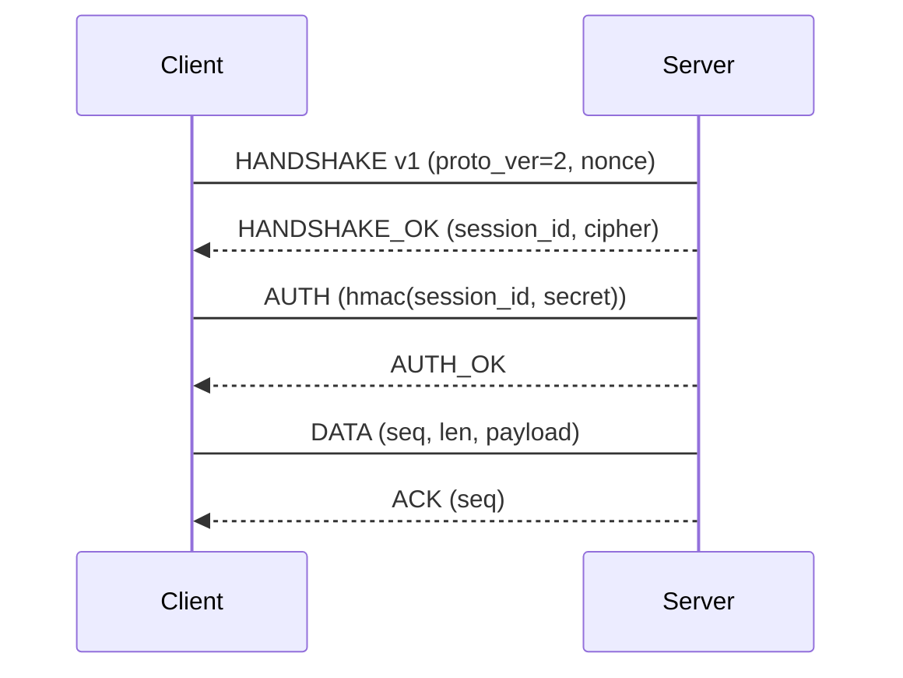

# Case study: PCAP → wire schema → parser

End-to-end walkthrough for a custom protocol captured from a PCAP. Few-shot example:
capture → framing inference → field verification → state machine → clean-room parser.

## 1. Capture

```
tcpdump -i lo0 -w cap.pcap            # loopback capture (or WireMCP / frida-mcp)
python3 scripts/triage_binary.py target.bin   # confirm the client binary's framing hints
```

## 2. Framing inference loop

Align N sessions byte-by-byte and diff by column (see `05-protocols-ipc.md`):

- Bytes constant across all sessions → header magic `0xCAFE`.
- Bytes monotonic increasing → sequence counter.
- Bytes matching following-data length → length prefix (`u32` BE).
- Bytes with small cardinality → message kind enum.

## 3. Verify by sending

Send a crafted frame with a modified field; observe parser response (reject/ack/error).
This confirms the field's role — never report framing from observation alone.

## 4. State machine



## 5. Clean-room parser

Freeze the spec (struct table + state machine), implement in Go/Rust (protocol fit),
layered: framing/IO → state machine → handlers → models. Golden tests replay captured
sessions; the parser must accept the same inputs and produce identical outputs
(byte-for-byte for wire formats).

## 6. Report

Deliverables per `08-output-standards.md`: protocol message table, struct table with byte
offsets and evidence, sequence diagram, clean-room parser, unknowns. Mark every inferred
field `inferred:`; mark invented names `proposed:`.
