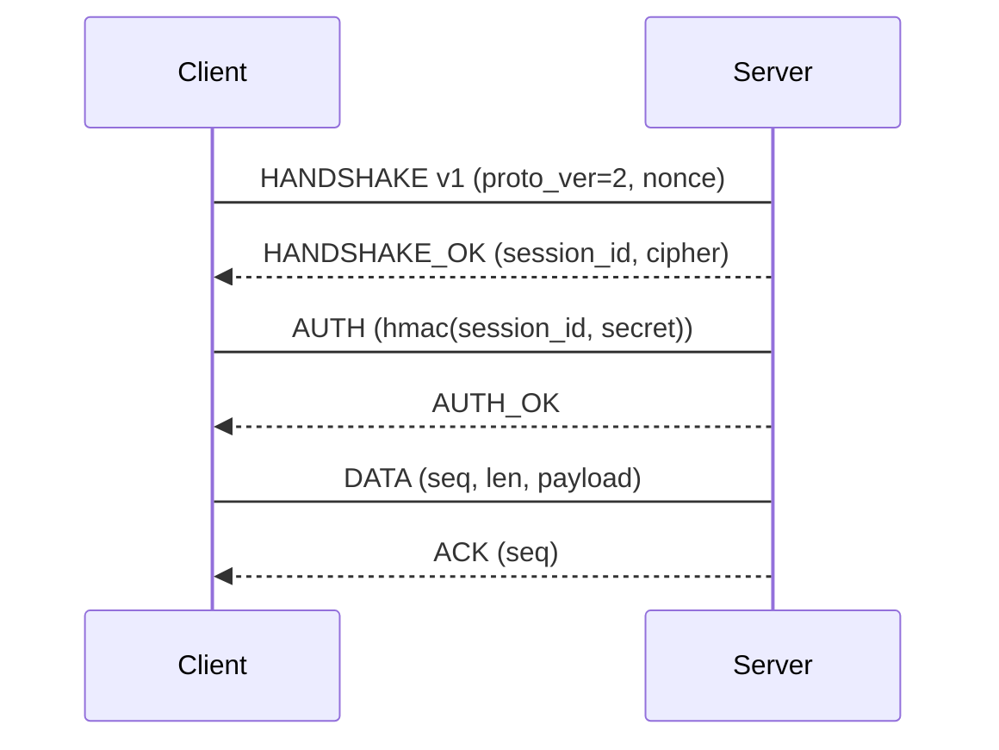

# Phase 4 — Protocol & IPC Reverse Engineering

## 0. Capture via tooling, not hand-rolled scraping

Prefer MCP-based capture where available — see `references/10-mcp-tooling.md`:
- **WireMCP** (Wireshark MCP) for PCAP/network analysis.
- **frida-mcp** for live instrumentation.
- **GDB/LLDB MCP** for dynamic stepping.
- Fall back to CLI: `tcpdump -i lo0 -w cap.pcap`, `strace -e trace=network`, `dtrace`, frida
  hooks for exact byte-level framing without packet noise.

## 1. Network protocol reconstruction (PCAP / live capture)

**Framing analysis (in order):**
1. **Delimiter-based:** newline, `\r\n\r\n`, `\x00` terminator, length-prefix (`u32` LE/BE
   before payload — check both), magic+length (`HTTP`-style `Content-Length`, `Netty`-style
   4-byte BE, `Protobuf` varint).
2. **Magic numbers:** fixed header bytes at offset 0 (e.g. `0xCAFE`, `BM`, `GZIP`, `PK`).
3. **Handshake:** connect → banner → version/feature negotiation → auth (challenge-response,
   HMAC, nonce) → data phase. Map each stage.
4. **RPC structures:** message type field (first byte/short), sequence numbers, session IDs,
   timestamps (epoch/monotonic), payload length, compression flags (zlib/gzip/lz4/zstd magic
   bytes), checksums (CRC32, CRC16, adler32, xor8, custom — verify by recomputing).

**Field inference loop:**
```
Capture N sessions → align bytes by position → column-wise diff:
- bytes constant across all sessions → header/magic
- bytes constant within a session, vary across → session ID / nonce
- bytes monotonic increasing → counter/sequence/timestamp
- bytes with small cardinality → enum/type/message kind
- bytes matching length of following data → length prefix
- bytes matching CRC of known algorithms → checksum (verify!)
```
Verify every hypothesis by *sending* a crafted frame with a modified field and observing the
parser's response (reject, ack, error code) — on localhost.

**Common embedded formats to check for before calling it "custom":**
Protobuf (field tags = `(field<<3)|wiretype`), MessagePack (`0x80+` maps, `0xA0+` strings), BSON,
CBOR, FlatBuffers, Thrift, Cap'n Proto, Java `ObjectOutputStream` (`AC ED 00 05`), .NET
`BinaryFormatter`, Flash `AMF3`, custom TLV (tag-length-value — ubiquitous).

## 2. IPC mechanisms

| Mechanism | How to trace |
|-----------|--------------|
| Unix domain socket | `lsof -U`, `strace -e trace=read,write -p <pid>`, `ss -x` |
| Named pipe (FIFO) | `lsof | grep FIFO`, `strace` on `open`/`mkfifo` |
| Mach ports (macOS) | `launchctl list`, `lsb`/`machiavelli`, `nm -gU` for MIG glue |
| COM/DCOM (Windows) | `OleView`, registry `HKCR\CLSID`, `IDL` reconstruction |
| Shared memory | `lsof -m`, `/proc/<pid>/maps` (Linux), `vmmap` (macOS); note layout offsets |
| Signals / `kill` | `strace -e trace=signal` |
| `ZeroMQ` / `Nanomsg` | magic strings, `ZMTP` framing (`00 00 00 00 00 00 00 00` + flags) |
| `DBus` / `Mach` XPC | `busctl`, `dbus-monitor`, XPC dump via `xpc` tools |
| `sysv`/`posix` MQ | `strace -e trace=mq_*` |

**IPC deliverable:** message schema (fields, offsets, types, endianness), direction, framing,
session lifecycle, and a sequence diagram (Mermaid `sequenceDiagram` or ASCII).

## 3. State machines

Reconstruct from observed sequences:
1. List all message/opcode types observed (from PCAP, IPC trace, or handler table).
2. Build transition table: `(state, msg) → (new state, response)`. Start from handshake; fill
   in by observation; mark unreachable/untested states.
3. Validate: every observed transition must be covered; note inferred-but-untriggered ones
   (error paths, timeout paths).



## 4. Database schema & serialization reconstruction

- **SQL:** from ORM artifacts, `CREATE TABLE` strings, or a live DB dump if permitted; document
  table, column, type, constraints.
- **Binary serialization:** from struct reconstruction — document field name, offset, size,
  type, endianness, encoding (UTF-8/16, varint, fixed), and whether the field is signed/unsigned.
- **Deliverable:** struct table with byte offsets and evidence, plus a round-trip serializer
  sketch in the clean-room language. Validate layout with `scripts/validate_struct.py`.

## 5. Anti-analysis during dynamic capture

- Certificate pinning (TLS interception fails) → hook `SSL_CTX`/`SecTrust` or capture
  pre-encryption via hooking (frida/ptrace) — `scripts/frida_templates/ssl_unpin.js` and
  `scripts/frida_templates/hook_crypto.js` cover the common cases.
- App detects instrumentation (`frida-server` name, `gum` markers) → rename or use kernel-level
  capture.
- Rate limits/locks during capture → capture in bursts, not continuous.
